<!-- PORTFOLIO DATA
title: SnapSolve.ai
description: Unleash your creativity with SnapSolve.ai, a  dynamic web app that transforms your sketches into actionable insights, powered by the cutting-edge Google Gemini 1.5 Flash AI.
skills: React, TypeScript, Vite, FastAPI, Gemini-API
image: https://raw.githubusercontent.com/kamalkolisetty/SnapSolve.ai/main/wtoo/2.png
-->

# 🚀 Welcome to **SnapSolve.ai**

Ever wished your doodles could *think*? 🎨✏️  
**SnapSolve.ai** is a playful yet powerful web app that transforms your sketches into knowledge — powered by **Google Gemini 1.5 Flash**.  

It all began with an Apple ad on canvas-based evaluation. Inspired, I created `windowsToo` (yep, the quirky entry point in `index.html`) and even added a Windows-style favicon 🪟 — because why limit the magic to just one platform?  

---

## ✨ What Can You Do?

From a messy napkin scribble to crisp LaTeX, SnapSolve.ai understands it all:

- ➕ **Arithmetic**: `2 + 2`  
- 🔢 **Advanced calculus**: `∫ x² dx`  
- ⚡ **Physics diagrams**: circuits, forces, waves  
- ⚗️ **Chemistry equations**: `H₂ + O₂ → H₂O`  
- 🌍 **Languages & poetry**: any script, any style  
- ❤️ **Abstract ideas**: draw a heart → get *love*  

---

## 🎨 Why It’s Fun

Not just functional — SnapSolve.ai is crafted with delight:

- 🖌️ A vibrant canvas with colorful swatches  
- 😊 A smiley cursor that follows you around  
- 💫 An animated About page with personality  

Perfect for **students**, **educators**, and **creatives** who love turning imagination into expression.  

---


## 🚀 Explore the Sleek UI

Dive in and experience it yourself:  
- [Netlify](https://snapsolve-ai.netlify.app/)  
- [Choreo](https://ab778f97-bbe9-4c37-b86f-4cca944bc744.e1-us-east-azure.choreoapps.dev)  
 
 
### 🌟 Let’s not just solve problems — let’s **Solve, Save & Shine!** ❤️✨

---

## 🌟 Features: A Canvas of Possibilities

SnapSolve.ai is your creative playground, transforming *any* drawing in *any language* into meaningful results. Below is a detailed look at its capabilities:

| Feature | Description |
|---------|-------------|
| **Dynamic Canvas** | Draw anything—simple math (`2 + 2`), advanced calculus (`∫(x^2 dx)`), physics diagrams (e.g., pulleys), chemical equations (`H2 + O2 → H2O`), poetry in any language, or abstract sketches (e.g., a heart for “love”). Supports mouse and touch input for seamless drawing on desktop or mobile. Features a black canvas (>768px) for bold contrast or white canvas (≤768px) for mobile clarity. Save drawings as `snapsolve_ai.png`. Named `windowsToo` with a Windows icon favicon to honor its universal vision. |
| **Vibrant Swatches** | Choose from 14 vibrant colors on desktop (e.g., red, blue, cyan, pink) or 5 on mobile for simplicity, with a hover zoom effect for a playful touch. A custom smiley cursor (`/one.png`) brings joy to every stroke, optimized for flawless performance across devices. |
| **Smart Eraser** | Erase mistakes effortlessly by matching the canvas background (black on desktop, white on mobile), ensuring precise corrections without disrupting your work. |
| **LaTeX & Text Outputs** | View results in draggable boxes below the navbar, rendered in crisp LaTeX for math (e.g., `x^2 + 2x + 1 = 0` → `x = -1`) or clear text for non-math inputs (e.g., a heart sketch → “love”). Supports variable assignments (e.g., `x = 4`) and multilingual inputs, with responsive styling for all screens. |
| **Professional Print Page** | Generate a polished print page with a glowing *SnapSolve.ai* header, *Solve, Save, Shine!* tagline, and a “Back to Home” button for seamless navigation, perfect for homework, presentations, or creative outputs. |
| **Responsive Design** | Adapts to every device: wide canvas with 14 swatches (>768px), stacked navbar with 5 swatches (≤768px), and scaled fonts/buttons (≤480px) for readability and ease of use. |
| **Vibrant About Page** | Explore a stunning gradient background with floating symbols (π, √, ∞, ❤️, ✨, ☕) and interactive feature cards, showcasing the app’s capabilities with flair. |
| **AI-Powered Analysis** | Powered by Google Gemini 1.5 Flash, processes *any* drawing in *any language*—from math and science to poetry and abstract concepts—with robust parsing for accurate results. |
| **Friendly Error Handling** | Displays playful alerts for empty canvas or processing issues, ensuring a delightful user experience even when things go wrong. |

---

 

 

## 🚀 Installation Steps

To unlock the full AI-powered functionality of SnapSolve.ai, clone the repository and set it up locally. Follow these steps to get started:

### Prerequisites
- **Node.js** (v16+): Required for the frontend.
- **Python** (3.8+): Required for the backend.
- **Git**: To clone the repository.

### Setup Instructions
1. **Clone the Repository**:
   ```bash
   git clone https://github.com/kamalkolisetty/SnapSolve.ai.git
   cd SnapSolve.ai
   ```
2. **Frontend Setup**:
   ```bash
   cd frontend
   npm install
   npm run build  # For deployment to Netlify/Choreo
   npm run dev    # For local development
   ```
3. **Backend Setup**:
   ```bash
   cd backend
   pip install -r requirements.txt
   python main.py
   ```

### Environment Variables
- **Frontend**: Create a `frontend/.env` file with:
  ```
  VITE_API_URL=http://localhost:8000
  ```
  Ensure `/one.png` (smiley cursor) and `/windows-icon.png` (Windows icon favicon) are in `frontend/public`.
- **Backend**: Create a `backend/.env` file with:
  ```
  GEMINI_API_KEY=your-key
  GEMINI_API_KEY2=your-key2
  GEMINI_API_KEY3=your-key3
  SERVER_URL=0.0.0.0
  PORT=8900
  ENV=dev
  ```

### Running the Application
- **Frontend**: After setup, run `npm run dev` and open `http://localhost:5173` to see SnapSolve.ai with the `windowsToo` branding and Windows icon favicon.
- **Backend**: Run `python main.py` to start the FastAPI server.

### Usage
- Draw on the canvas: equations, multilingual poetry, diagrams, or sketches.
- Click *Run* to process drawings with Gemini AI, viewing results in draggable LaTeX/text boxes.
- Use *Save Canvas* to download as `snapsolve_ai.png`.
- Click *Print* for a professional output page with the Windows icon favicon.
- Explore the About page for animated symbols and feature highlights.


## 🔥 Important Code Parts

Below are the key code snippets that power SnapSolve.ai’s core features, each labeled with its purpose and file location for clarity.


### 1. Canvas Setup with Windows Icon

**File**: `frontend/src/index.tsx`  
**Purpose**: Initializes the canvas with responsive background and smiley cursor, and sets the Windows icon favicon for the `windowsToo` branding.

```tsx
const canvasRef = useRef<HTMLCanvasElement>(null);
const ctxRef = useRef<CanvasRenderingContext2D | null>(null);
const isSmallScreen = window.innerWidth <= 768;

useEffect(() => {
    const canvas = canvasRef.current!;
    const ctx = canvas.getContext('2d')!;
    ctxRef.current = ctx;
    ctx.strokeStyle = isSmallScreen ? 'black' : 'white';
    ctx.lineWidth = 3;
    // Set Windows icon favicon
    document.querySelector('link[rel="icon"]')?.setAttribute('href', '/windows-icon.png');
}, []);

<canvas
    ref={canvasRef}
    className="canvas"
    style={{ cursor: `url('/one.png') 8 8, crosshair`, background: isSmallScreen ? 'white' : 'black' }}
/>
```

### 2. Color Swatch Selection
**File**: `frontend/src/styles.css`  
**Purpose**: Styles the color swatches with a hover zoom effect for an interactive experience.

```css
.swatch {
    width: 30px;
    height: 30px;
    border-radius: 50%;
    cursor: pointer;
    transition: transform 0.3s ease;
}
.swatch:hover {
    transform: scale(1.2);
}
```

### 3. Smart Eraser Logic
**File**: `frontend/src/index.tsx`  
**Purpose**: Implements the eraser functionality, matching the canvas background for precise corrections.
```tsx
const erase = () => {
    if (ctxRef.current) {
        ctxRef.current.strokeStyle = isSmallScreen ? 'white' : 'black';
        setCurrentColor(isSmallScreen ? 'white' : 'black');
    }
};
```

### 4. LaTeX and Text Output Rendering
**File**: `frontend/src/index.tsx`  
**Purpose**: Sends canvas images to the backend, renders results in draggable LaTeX/text boxes, and handles variable assignments.
```tsx
const runRoute = async () => {
    try {
        if (!ctxRef.current!.getImageData(0, 0, canvasRef.current!.width, canvasRef.current!.height).data.some((channel: number) => channel !== 0)) {
            alert("Canvas is empty!");
            return;
        }
        const response = await axios.post(`${import.meta.env.VITE_API_URL}/calculate`, {
            image: canvasRef.current!.toDataURL("image/png"),
            dict_of_vars: dictOfVars
        });
        setLatexPairs([...latexPairs, ...response.data.data]);
        response.data.data.forEach((pair: { expr: string; result: string; assign: boolean }) => {
            if (pair.assign) setDictOfVars({ ...dictOfVars, [pair.expr]: pair.result });
        });
    } catch {
        alert("Uh-oh! 😢 We're down right now, please try again later! 🚀");
    }
};

{latexPairs.map((pair, index) => (
    <Draggable key={index}>
        <div className="latex-content">
            {pair.expr} = {pair.result}
        </div>
    </Draggable>
))}
```

### 5. Print Page Navigation
**File**: `frontend/src/index.tsx`  
**Purpose**: Generates a formatted print page with results and a “Back to Home” button, including the Windows icon favicon.
```tsx
const printQueries = () => {
    const printWindow = window.open('', '_blank');
    printWindow!.document.write(`
        <html>
            <head>
                <title>SnapSolve.ai - Print Results</title>
                <link rel="icon" href="/windows-icon.png" />
                <style>
                    body { font-family: 'Poppins', sans-serif; text-align: center; }
                    h1 { color: #00c9ff; text-shadow: 0 2px 5px rgba(255, 255, 255, 0.4); }
                </style>
            </head>
            <body>
                <h1>SnapSolve.ai</h1>
                <p>Solve, Save, Shine!</p>
                ${latexPairs.map(pair => `<p>${pair.expr} = ${pair.result}</p>`).join('')}
                <button onclick="window.opener.focus();window.close();">Back to Home</button>
            </body>
        </html>
    `);
};
```

### 6. Responsive Navbar and Canvas Styling
**File**: `frontend/src/styles.css`  
**Purpose**: Ensures the navbar and canvas adapt to different screen sizes for a seamless experience.
```css
@media (max-width: 768px) {
    .navbar {
        flex-direction: column;
        gap: 12px;
    }
    canvas {
        width: 90vw;
        height: 60vh;
        background: white;
    }
}
@media (max-width: 480px) {
    .navbar button {
        font-size: clamp(0.9rem, 2.3vw, 1rem);
    }
}
```

### 7. About Page Floating Symbols
**File**: `frontend/src/about.css`  
**Purpose**: Animates floating symbols (π, √, ∞, ❤️, ✨, ☕) on the About page for a captivating effect.
```css
@keyframes float {
    0% { transform: translate(0, 0) rotate(0deg); }
    25% { transform: translate(10px, -10px) rotate(5deg); }
    50% { transform: translate(0, -15px) rotate(0deg); }
    75% { transform: translate(-10px, -10px) rotate(-5deg); }
    100% { transform: translate(0, 0) rotate(0deg); }
}
.math-symbol {
    position: absolute;
    font-size: clamp(2rem, 4vw, 2.5rem);
    color: rgba(0, 201, 255, 0.3);
    animation: float 6s ease-in-out infinite;
}
```

### 8. Gemini Response Parsing
**File**: `backend/utils.py`  
**Purpose**: Robustly parses Gemini API responses to handle math, science, poetry, and abstract inputs in any language.

```python
try:
    answers = ast.literal_eval(cleaned_response)
    if isinstance(answers, dict):
        answers = [answers]
except:
    pattern = r'\{.*?\}'
    matches = re.findall(pattern, cleaned_response, re.DOTALL)
    processed_answers = []
    for match in matches:
        expr_match = re.search(r'"expr"\s*:\s*"([^"]*)"', match)
        result_match = re.search(r'"result"\s*:\s*([^,}]+)', match)
        assign_match = re.search(r'"assign"\s*:\s*(true|false|"true"|"false")', match, re.IGNORECASE)
        if expr_match and result_match:
            processed_answers.append({
                'expr': expr_match.group(1),
                'result': result_match.group(1).strip(),
                'assign': assign_match.group(1).lower().replace('"', '') == 'true' if assign_match else False
            })
```


## 🌈 Why SnapSolve.ai?

SnapSolve.ai redefines creativity and learning with:
- **Universal Processing**: Handles simple math, advanced calculus, physics, chemistry, multilingual poetry, and abstract sketches in any language supported by Gemini, making it a global tool for education and creativity.
- **Engaging Experience**: A smiley cursor, animated symbols, responsive design, and `windowsToo` branding with a Windows icon favicon create a fun, intuitive interface that captivates users.
- **Open-Source Innovation**: Built on cutting-edge technologies and inspired by projects like `Authman2/Canvas`, SnapSolve.ai invites collaboration and inspires future creators.
- **Seamless Usability**: From touch-friendly mobile drawing to professional print outputs, every detail is crafted for ease and delight, ensuring your ideas shine.

---

## 🎥 Demo Video

[](https://drive.google.com/file/d/1CFd3Oou9HO4tmP79kJpBWyM7HsB82khc/view?usp=sharing)  
*Witness SnapSolve.ai transform equations, multilingual poetry, and sketches into stunning results under the `windowsToo` banner!*

---

 

## 📸 Screenshots

Explore SnapSolve.ai’s vibrant features through these screenshots, showcasing its versatility and user-friendly design:

| Screenshot | Description |
|------------|-------------|
| 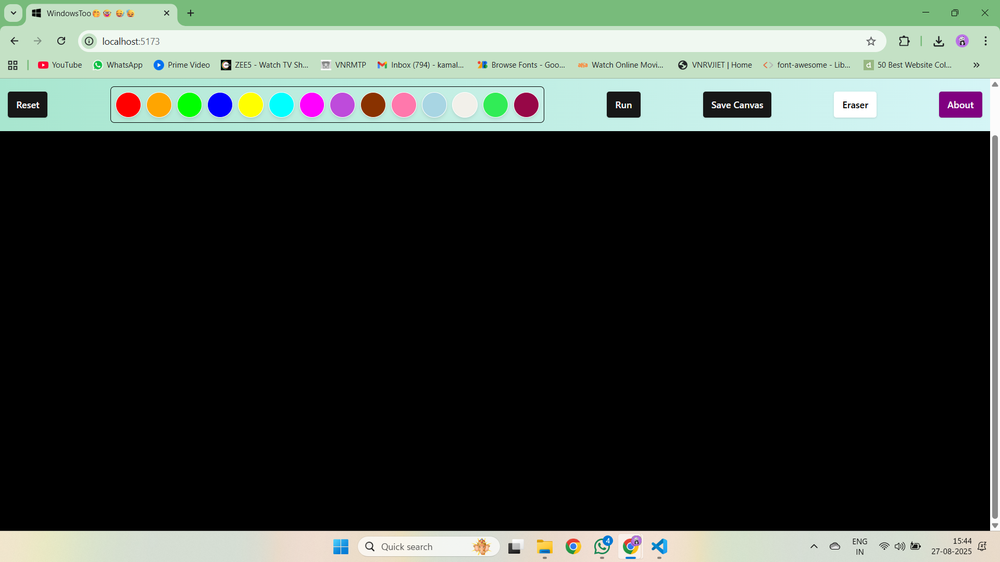 | The welcoming landing page of SnapSolve.ai, featuring the `windowsToo` branding and Windows icon favicon. |
|  | Sketching a heart symbol on the canvas, interpreted as “love” by the AI, with the smiley cursor in action. |
| 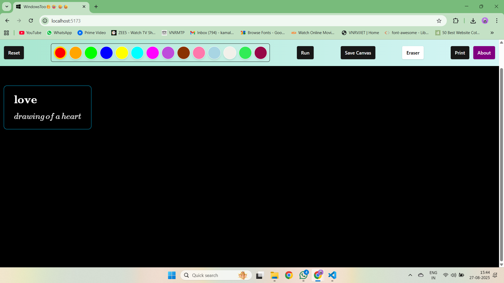 | Displaying the AI-generated result for the heart sketch, rendered in a draggable text box. |
| 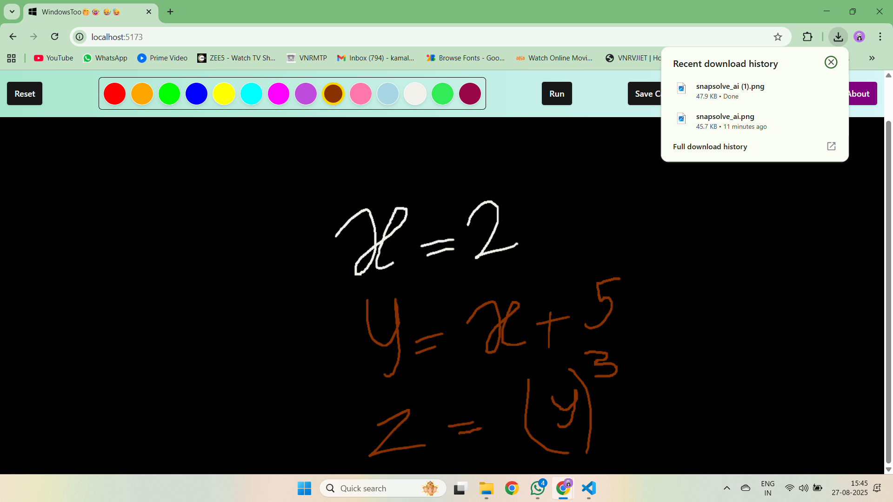 | Writing a mathematical equation (e.g., `x^2 + 2x + 1 = 0`) on the canvas with vibrant swatches. |
| 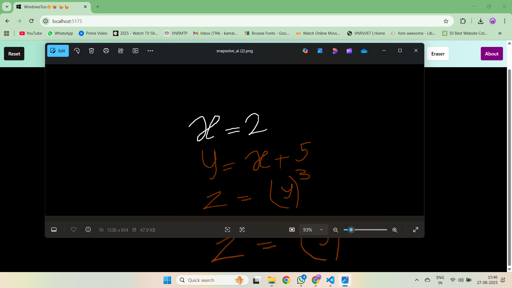 | Demonstrating the *Save Canvas* feature, downloading the drawing as `snapsolve_ai.png`. |
| 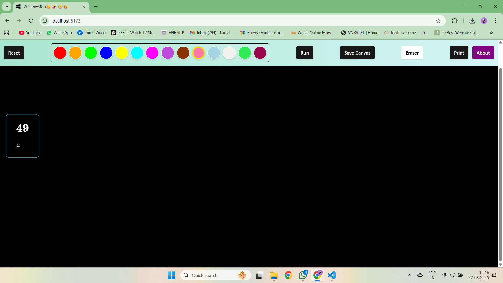 | Showing the equation evaluated by Gemini AI, with the result (e.g., `x = -1`) in a draggable LaTeX box. |
| 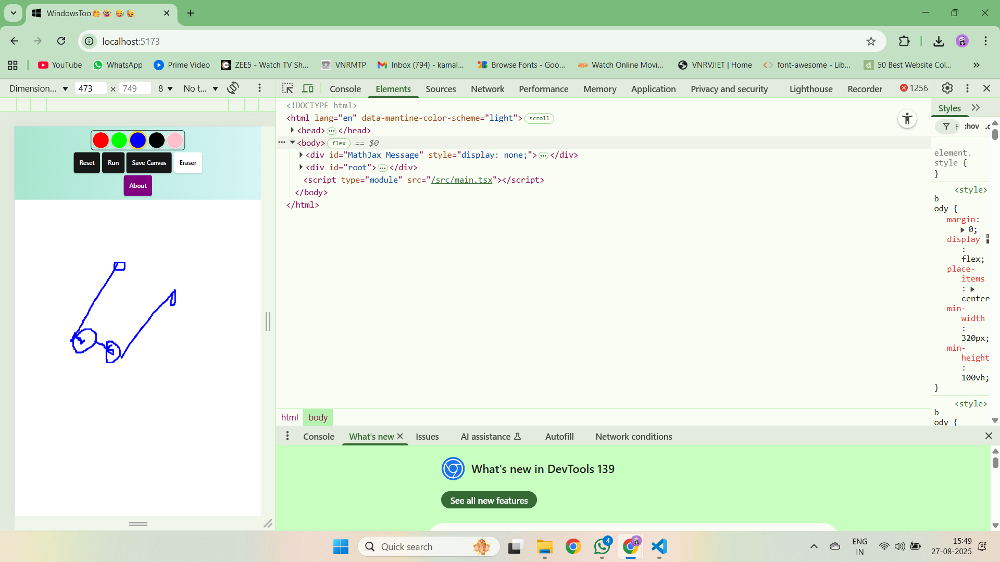 | Highlighting the responsive design on mobile, with a white canvas and stacked navbar for ease of use. |
| 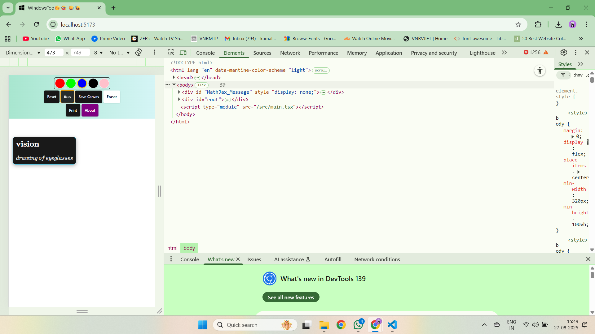 | Displaying AI-generated results on a mobile screen, optimized for readability and interaction. |
| 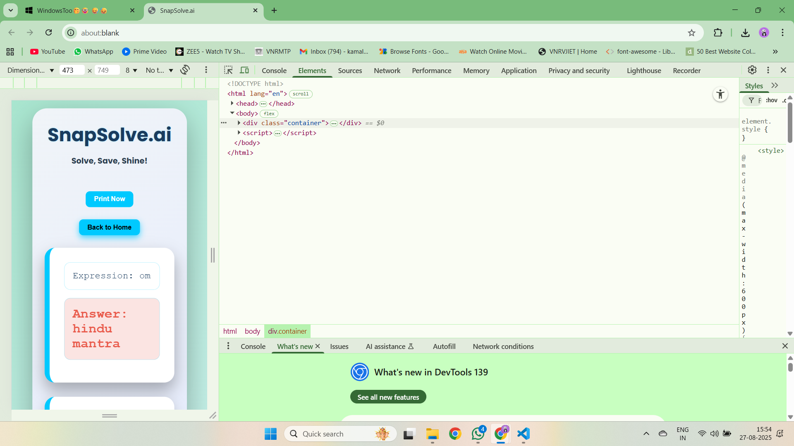 | Showcasing the *Print* option, opening a formatted page with the *Solve, Save, Shine!* tagline and Windows icon favicon. |
| 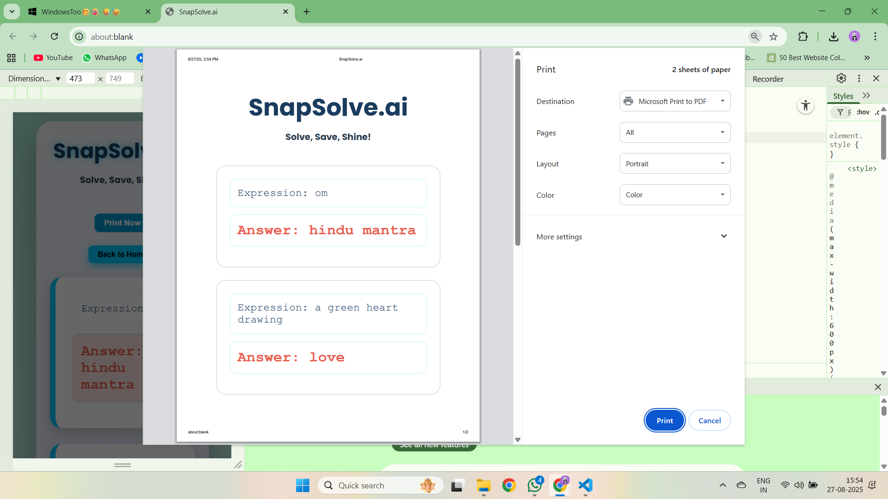 | Previewing the generated PDF from the print page, perfect for professional outputs. |
| 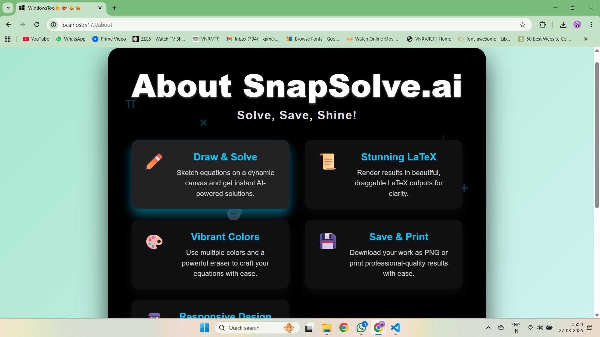 | The vibrant About page on desktop, featuring floating symbols (π, √, ∞, ❤️, ✨, ☕) and interactive feature cards. |
| 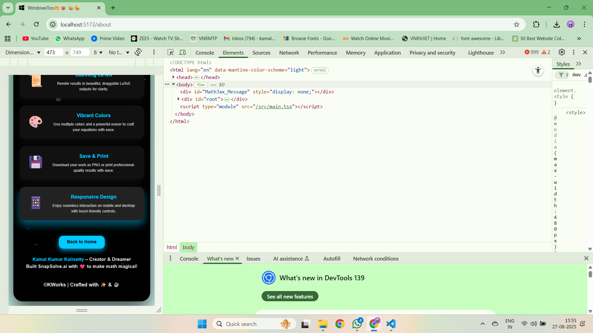 | The About page on a smaller desktop width, showcasing responsive design with animated symbols. |

 
---

## 🌍 Inspiration: From Vision to Reality

Inspired by an Apple advertisement showcasing canvas-based evaluation, I created SnapSolve.ai to bring this magic to Windows users and beyond. The `windowsToo` name in `index.html` and the Windows icon favicon (`/windows-icon.png`) embody this mission, making advanced drawing analysis accessible to all. SnapSolve.ai goes further, processing *any* drawing—math, physics, chemistry, poetry, or abstract concepts—in any language supported by Google Gemini 1.5 Flash, empowering students, educators, and creatives globally to unleash their creativity.

---

## 🧑‍💻 Tech Stack: Powering the Magic

SnapSolve.ai leverages a robust stack of open-source technologies, enhanced with custom innovations for a seamless experience:

| Component | Technologies |
|-----------|--------------|
| **Frontend** | **React (18.x)**: Dynamic UI with components for canvas, navbar, and outputs. <br> **TypeScript**: Type-safe development for reliability. <br> **Vite**: Lightning-fast build tool for development and deployment. <br> **react-draggable**: Draggable LaTeX/text output boxes. <br> **axios**: API calls to `/calculate` endpoint. <br> **MathJax (2.7.9)**: Crisp LaTeX rendering for equations. <br> **Tailwind CSS**: Utility-first styling for responsive design (e.g., `flex`, `rounded-lg`). <br> **Custom Assets**: Smiley cursor (`/one.png`), Windows icon favicon (`/windows-icon.png`), Poppins font for a modern look. |
| **Backend** | **FastAPI**: High-performance API for processing canvas images. <br> **Google Gemini 1.5 Flash**: AI-powered analysis for multilingual drawings. <br> **PIL (Python Imaging Library)**: Decodes base64 images for processing. <br> **uvicorn**: ASGI server for development mode. <br> **python-dotenv**: Manages environment variables (e.g., `GEMINI_API_KEY`). <br> **logging, re, ast**: Robust debugging and response parsing. |
| **Inspiration** | Open-source projects like `Authman2/Canvas` and `shuding/apple-pencil-safari-api-test`, alongside official documentation for React, FastAPI, Gemini API, and Stack Overflow community insights. |

 
---

## 🤝 Contributing

Contributions are welcome to enhance SnapSolve.ai! To contribute:
1. Fork the repository.
2. Create a branch (`git checkout -b feature/awesome-feature`).
3. Commit changes (`git commit -m 'Add awesome feature'`).
4. Push to the branch (`git push origin feature/awesome-feature`).
5. Open a Pull Request.
 

---

## 🙌 Acknowledgments

- **Open-Source Community**: Gratitude to React, TypeScript, Vite, FastAPI, Google Gemini API, PIL, `Authman2/Canvas`, `shuding/apple-pencil-safari-api-test`, and Stack Overflow for their invaluable resources.
- **Inspiration**: An Apple advertisement for canvas evaluation, reimagined as `windowsToo` for universal accessibility.

 
---

## 📬 Contact

Have questions or ideas? Reach out via [GitHub Issues](https://github.com/kamalkolisetty/SnapSolve.ai/issues) or [LinkedIn](https://www.linkedin.com/in/kamal-kumar-kolisetty-19b944221/).

Let’s *Solve, Save, Shine!* 🚀

©KWorks | Crafted with ✨ & ☕
